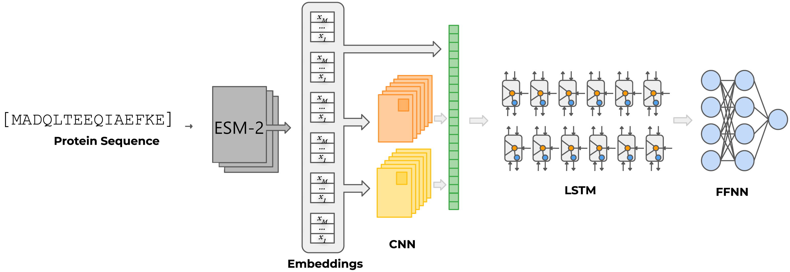

# PhosKing
# Group 112 project for 02456 Deep learning

PhosKing is a predictor of protein phosphorylation that uses ESM-2 embeddings as the basis for the prediction. [ESM-2](https://github.com/facebookresearch/esm) is a large protein language model released in August 2022 by Meta's AI research division, and pretrained weights are available for download.

Phosphorylation is one of the most common and widely studied PTMs. It involves the addition of a phosphoryl group to a protein, which commonly alters its structure and regulates a variety of processes, from metabolic activity to signal cascading. This can have a myriad of effects on the activity of cells.

The main Phosking model integrates Convolutional, Long-Short-Term Memory (LSTM) and Feedforward (FF) modules to produce its predictions. The input to this model is the ESM-2 embeddings of the target amino acid and a 16 amino acid window to each side of it. The embeddings are given as input to 2 independent convolutional layers, and their outputs are concatenated with the original ESM-2 embeddings. This new tensor is provided to a bidirectional LSTM module of 2 layers, which enables the model to capture contextual information about the protein sequence. Finally, the output of the LSTM module is provided to a FF module to produce the final output. This architecture is inspired by NetSurfP-3.0 ([paper](https://doi.org/10.1093/nar/gkac439)).

A demo can be found in [phosking_demo.ipynb](https://github.com/serestech/PhosKing/blob/main/phosking_demo.ipynb)

</cneter>
